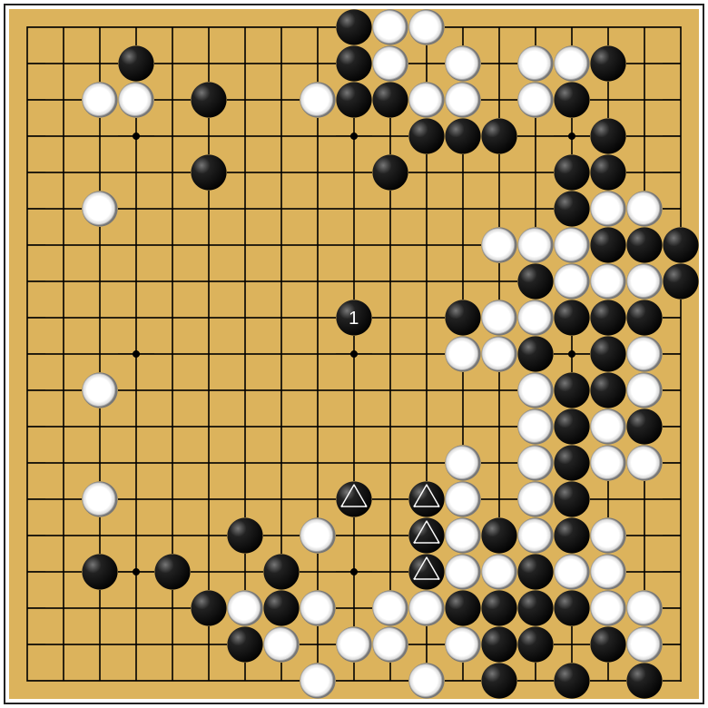

Hello!
---
<!-- ?image=ear_reddening.png -->
## Test caption
<!--  -->

    

+++

Hola!

<!-- ---
# Test multi-col

  

      
  

  

    
Random Text

  

 -->

---

Goodbye!

+++

Adiós!

$$\sum_{i=0}^n i^2 = \frac{(n^2+n)(2n+1)}{6}$$
